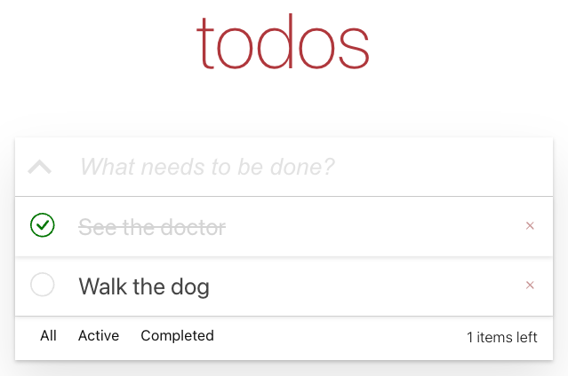

# About this project

This project is aboud building a classic to-do list application inspired by https://todomvc.com/. 

## Start the project

To start the project, you can need to start the mock server first: `npm run mockapi`.

Then, you can start the project with `npm start`.

## Run tests

To run the tests, you can run `npm test`.

